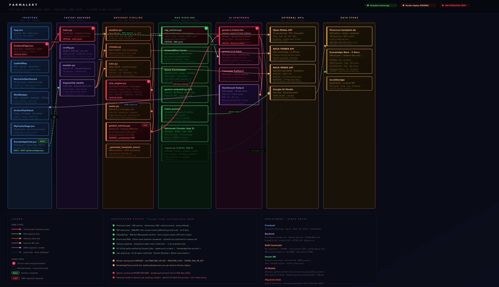

# 🌾 FarmAlert

> **మీ పొలం మా బాధ్యత** — Your Farm. Stays Safe.

**FarmAlert** is a free, AI-powered agricultural decision-support platform built for smallholder farmers in Telangana, India. It delivers hyper-local climate risk forecasts, satellite-derived crop health analysis, bilingual AI advisories in Telugu and English, and a RAG-powered knowledge base grounded in official government documents — all in one place.

🌐 **Live Demo:** [farmalert.vercel.app](https://farmalert.vercel.app)

---

## 📸 Screenshots

<!-- Add screenshots here -->
> _Dashboard · Risk analysis · RAG knowledge base chat_

---

## 🗺️ System Architecture


📄 **Full Technical Documentation:** [FarmAlert_Technical_Documentation_v1.pdf](./docs/FarmAlert_Technical_Documentation_v1.pdf)

The system has two parallel AI pipelines that both converge at Gemini 2.0 Flash:

- **Advisory pipeline** — fetches live satellite + weather data, runs through risk and water engines, generates a bilingual action plan
- **RAG knowledge base pipeline** — embeds farmer questions, searches Pinecone vector index, retrieves grounded document chunks, generates verified answers

---

## ✨ Features

### 🌦️ Hyper-local Climate Advisory
- 14-day weather forecast via **Open-Meteo API** (temperature, rainfall, UV, ET0)
- 22-year climate baseline anomaly detection via **NASA POWER API**
- Real-time satellite indices via **NASA MODIS** — NDVI, EVI, LST, LAI (180-day history)
- **6 risk classifications** — Heatwave, Drought, Flooding, Soil Moisture Drop, Wind Damage, Pest Risk
- **FAO-56 Penman-Monteith** crop water requirements with stage-specific Kc coefficients
- Bilingual daily / weekly / monthly action plans in **Telugu + English**

### 🤖 RAG Knowledge Base
- Floating chat widget on every page — glass pill design mirroring the navbar
- Answers grounded in **4 official government documents** (346 vectors, Pinecone)
- Query enrichment with farm context (crop + stage + location) for precision retrieval
- In-memory **OrderedDict cache** (100 entries, LRU eviction) — ⚡ instant on repeat questions
- Animated letter-by-letter placeholder text, macOS-style expand animation
- Attach saved farms from My Farms to personalize answers

### 🗺️ Farm Management
- Interactive **Leaflet map** for GPS-based farm location
- Save and manage multiple farms with risk history
- **My Farms** dashboard with last risk status per farm

---

## 🏗️ Tech Stack

| Layer | Technology |
|---|---|
| **Frontend** | React 18 · Vite · TailwindCSS · Leaflet · Framer Motion · motion/react |
| **Backend** | FastAPI · Python 3.11 · asyncio · uvicorn |
| **AI — Advisory** | Gemini 2.0 Flash (`gemini-2.0-flash`) |
| **AI — RAG Generation** | Gemini 2.5 Flash (`gemini-2.5-flash`) |
| **Embeddings** | `gemini-embedding-001` · 768 dimensions · Matryoshka truncation |
| **Vector Database** | Pinecone Serverless · `farmalert-kb` · cosine similarity · AWS us-east-1 |
| **Weather API** | Open-Meteo (14-day forecast · ET0) |
| **Climate API** | NASA POWER (22-year baseline) |
| **Satellite API** | NASA MODIS (NDVI · EVI · LST · LAI) |
| **Frontend Hosting** | Vercel |
| **Backend Hosting** | Render (free tier · 512MB RAM) |

---

## 📚 Knowledge Base Documents

| Document | Source | Pages | Chunks |
|---|---|---|---|
| PM-KISAN Operational Guidelines | pmkisan.gov.in | 12 | 15 |
| Telangana Kharif Agro-Advisory 2025 | icar.org.in | 7 | 12 |
| ICAR Soil & Nutrient Management (NRM-2702) | icar.org.in | 115 | 104 |
| PMFBY Crop Insurance Guidelines | pmfby.gov.in | 144 | 215 |
| **Total** | | **278** | **346** |

---

## 🔌 API Endpoints

| Method | Endpoint | Description |
|---|---|---|
| `POST` | `/api/analyze` | Full farm analysis — weather + satellite + risk + water + Gemini advisory |
| `POST` | `/api/knowledge-base` | RAG Q&A — embedding + Pinecone search + grounded Gemini answer |
| `GET` | `/` | Health check |

### `/api/analyze` Request
```json
{
  "lat": 17.9784,
  "lng": 79.5941,
  "crop_type": "cotton",
  "crop_stage": "flowering",
  "soil_type": "black",
  "location_name": "Warangal, Telangana"
}
```

### `/api/knowledge-base` Request
```json
{
  "question": "Am I eligible for PM-KISAN scheme?",
  "crop": "cotton",
  "stage": "flowering",
  "location": "Warangal, Telangana"
}
```

### `/api/knowledge-base` Response
```json
{
  "answer": "To be eligible for PM-KISAN...",
  "cached": false
}
```

---

## 🚀 Local Setup

### Prerequisites
- Python 3.11+
- Node.js 18+
- Pinecone account (free tier)
- Google AI Studio API key(s)

### Backend

```bash
cd backend
python -m venv .venv
source .venv/bin/activate  # Windows: .venv\Scripts\activate
pip install -r requirements.txt
```

Create `backend/.env`:
```env
GEMINI_API_KEY=your_gemini_api_key
GEMINI_RAG_API_KEY=your_rag_gemini_api_key
PINECONE_API_KEY=your_pinecone_api_key
PINECONE_HOST=your_pinecone_index_host
```

```bash
python run.py
```

### Frontend

```bash
cd frontend
npm install
```

Create `frontend/.env`:
```env
VITE_API_URL=http://localhost:8000
```

```bash
npm run dev
```

### Knowledge Base Ingestion

```bash
cd backend
# Add PDFs to data/source_docs/
python app/scripts/ingest.py
```

---

## 🏛️ Key Architecture Decisions

| Decision | Reason |
|---|---|
| No LangChain | RAM constraints on Render free tier (512MB) |
| Raw Pinecone SDK | Lighter footprint, direct control |
| PyMuPDF for PDF extraction | pypdf and pdfplumber had silent text duplication bug on sliced PDFs |
| `output_dimensionality=768` | Matryoshka Representation Learning — officially supported truncation, not lossy |
| `RETRIEVAL_DOCUMENT` vs `RETRIEVAL_QUERY` | Different embedding modes for ingestion vs query time — improves retrieval quality |
| Two separate Gemini API keys | Isolates advisory and RAG quota pools — prevents one feature from exhausting the other |
| In-memory cache (no Redis) | Zero added dependencies, zero cost, adequate for current scale |
| localStorage for farms | No database yet — sufficient for MVP, clean migration path to Supabase later |

---

## 📁 Project Structure

```
FARMALERT/
├── backend/
│   ├── app/
│   │   ├── main.py                 # FastAPI routes
│   │   ├── config.py               # Settings + env vars
│   │   ├── models.py               # Pydantic models
│   │   ├── services/
│   │   │   ├── gemini_service.py   # Advisory AI generation
│   │   │   ├── rag_service.py      # RAG pipeline
│   │   │   ├── risk_engine.py      # 6-type risk classification
│   │   │   ├── water.py            # FAO-56 water engine
│   │   │   ├── weather.py          # Open-Meteo integration
│   │   │   └── climate.py          # NASA POWER integration
│   │   └── scripts/
│   │       ├── ingest.py           # RAG document ingestion (local only)
│   │       └── verify_pinecone.py  # Index verification
│   ├── data/
│   │   └── source_docs/            # PDF knowledge base documents
│   └── requirements.txt
├── frontend/
│   └── src/
│       ├── pages/
│       │   ├── AnalysePage.jsx     # Main farm analysis
│       │   └── MyFarmsPage.jsx     # Saved farms
│       └── components/
│           └── KnowledgeChat.jsx   # RAG chat widget
└── docs/
    └── farmalert_complete_system_architecture.png
```

---

## 🌱 Roadmap

- [ ] Render deployment with all env vars (in progress)
- [ ] Frontend RAG chat UI connected to live backend
- [ ] Add 10–15 more knowledge base documents
- [ ] Supabase database for cross-device farm sync
- [ ] Migrate `gemini_service.py` to new `google-genai` SDK
- [ ] Mobile-responsive UI improvements
- [ ] Push notifications for critical risk alerts
- [ ] Telugu language input support in RAG chat

---

## 👨‍💻 Author

**Suhas Naragani**
- GitHub: [@SuhasNaragani](https://github.com/SuhasNaragani)
- Project: [farmalert.vercel.app](https://farmalert.vercel.app)

---

## 📄 License

This project is open source and available under the [MIT License](LICENSE).

---

<div align="center">
  <strong>Built for Telangana farmers 🌾</strong><br/>
  <em>మీ పొలం మా బాధ్యత</em>
</div>
